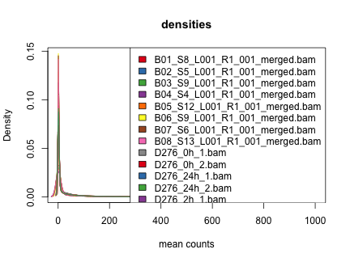
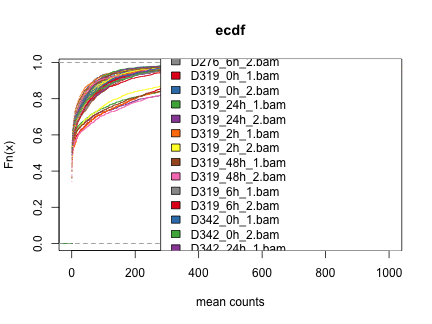
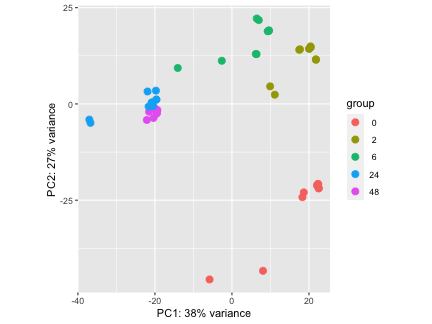
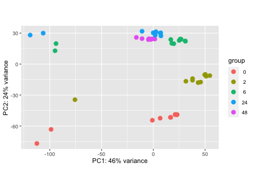
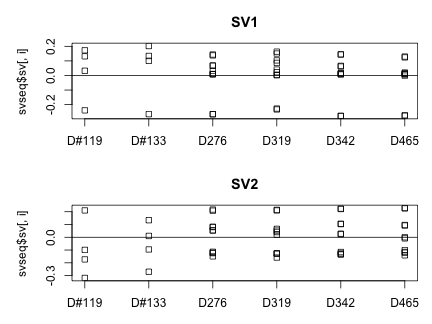

## RNA Seq Markdown for Elucidata

### Loading the required libraries for Analysis

```r
library(readxl)
library(DESeq2)
library(gplots)
library(geneplotter)
library(tidyverse)
library(dplyr)
```

### Inputting the provided data


```r
exp6_exp3 <- read_xlsx("~/Desktop/GitHub/Elucidata_RNASeq/Exp6_Exp3_Counts_Test.xlsx")
exp6_exp3_metadata <- read_xlsx("~/Desktop/GitHub/Elucidata_RNASeq/Exp6_Exp3_Counts_Test_Metadata.xlsx")
countdata <- exp6_exp3 %>% select(-Gene)
countdata <- as.matrix(countdata)
rownames(countdata) <- exp6_exp3$Gene
coldata <- as.matrix(exp6_exp3_metadata)
rownames(coldata)<-exp6_exp3_metadata$RowNames
Exp_data<-DESeqDataSetFromMatrix(countData = countdata, colData = coldata, design = ~ Time)
```

### Counting the number of genes in the dataset


```r
GeneCounts <- counts(Exp_data)
idx.nz <- apply(GeneCounts, 1, function(x) { all(x > 0)})
sum(idx.nz)
```

```
## [1] 26451
```

### Normalization - Applying Regularized logarithm transformation


```r
rld <- rlog(Exp_data, blind = FALSE)
Exp_data <- estimateSizeFactors(Exp_data)

## Verifying if normalization has occured correctly
multidensity( counts(Exp_data, normalized = T)[idx.nz ,],xlab="mean counts", xlim=c(0, 1000))
```



```r
## From the plot, we can see normalization was done on the dataset. 
multiecdf( counts(Exp_data, normalized = T)[idx.nz ,],xlab="mean counts", xlim=c(0, 1000))
```



```r
## From the plot, the overlaps of different samples shows normalization was done on the dataset.  
```


### PCA Plots 


```r
plotPCA(rld,intgroup="Time",ntop=500)
```



```r
##The PCA plot here shows there is an overlap for the time points at 2 and 6 hours

plotPCA(rld,intgroup="Time",ntop=5000)
```



```r
##This PCA plot here shows there is a better separation for the time points, however due to some overlap for timepoints 6, 24 and 48 hours

## Question 1: The PCA does not change drastically but we can see a better separation between different time points.
## Question 2: There maybe some noise in this dataset.
## Question 3: The PCA plots show there is a certain amount of noise in this dataset. 
```


### Batch Effect Removal


```r
library("sva") ## Loading library sva, for removing batch effects
dat  <- counts(Exp_data, normalized = TRUE)
idx  <- rowMeans(dat) > 1
dat  <- dat[idx, ]
mod  <- model.matrix(~ Donor, colData(Exp_data))
mod0 <- model.matrix(~   1, colData(Exp_data))
svseq <- svaseq(dat, mod, mod0, n.sv = 2)
```

```
## Number of significant surrogate variables is:  2 
## Iteration (out of 5 ):1  2  3  4  5
```

```r
par(mfrow = c(2, 1), mar = c(3,5,3,1))
for (i in 1:2) {
  stripchart(svseq$sv[, i] ~ Exp_data$Donor, vertical = TRUE, main = paste0("SV", i))
  abline(h = 0)
 }
```



```r
## Question 1: The batch effect isnt consistent among all the donors

##Question 2: Fixing the batch effect on the data
Exp_datasva <- Exp_data
Exp_datasva$SV1 <- svseq$sv[,1]
Exp_datasva$SV2 <- svseq$sv[,2]
design(Exp_datasva) <- ~ SV1 + SV2 + Time
```
